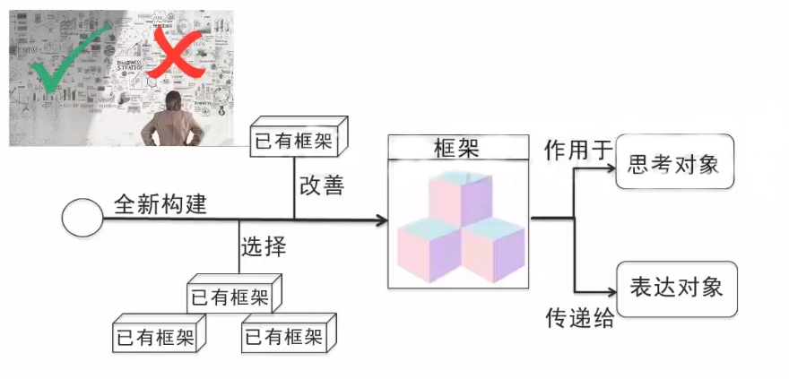

# 思维力训练：用框架解决问题

## 思维力不足的三大问题

- 分析时：想不明白
- 表达时：说不清楚
- 学习时：学不快速

- 系统思维是用框架来系统思考与表达的思维方式
- 系统思维就是构建、选择及改善，以用于更快速、更全面、更深入地思考和表达的思维方式

## 系统思维示意

- 优秀框架
  - 宏观环境的分析的PEST分析法
    - PEST分析是指宏观环境的分析，P是政治(politics)，E是经济(economy)，S是社会(society)，T是技术(technology)。在分析一个企业集团所处的背景的时候，通常是通过这四个因素来进行分析企业集团所面临的状况
  - 企业财务状况的杜邦分析法
  - 制定目标的SMART分析法

## 应用“框架”思考

- 营销类三大营销策略模型
  - 4P： Production产品, Price价值, place渠道 promotion促销 
  - 4C
  - 4R

## 运用"框架"表达

- 容易组合，产生预约
- 不能组合，产生晦涩，难懂

- 数字记忆小试验，3秒内记住14个数字
  - 7,2,9,6,7,1,5,1,8,3,4,3,0,5

- 换成14个数字，3秒内记住(**认知的框架**)
  - 0 1 2 3 4 5 6 7 8 9 7 5 3 1

